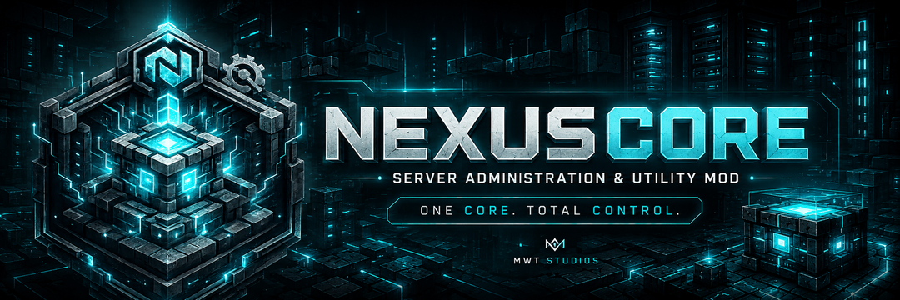

<p align="center">
  
</p>

<h1 align="center">NexusCore Administration Framework</h1>

<p align="center">
  <strong>Server administration for Minecraft Java Edition 1.21.1 — permissions, moderation,
  teleportation, player tools and a tamper-evident audit log, in one mod.</strong>
</p>

<p align="center">
  No plugin loader. No other administration mod. No database. No client mod.
</p>

<p align="center">
  <a href="https://github.com/Modzwastaken/NexusCore-Mod-NCM-/actions/workflows/build.yml"></a>
  
  
  
  
  
  
</p>

<p align="center">
  <a href="https://github.com/Modzwastaken/NexusCore-Mod-NCM-">Source</a> ·
  <a href="https://modrinth.com/mod/nexuscore-mod-ncm/versions">Downloads</a> ·
  <a href="https://discord.gg/Y2t5MHFBE8">Discord</a> ·
  <a href="https://github.com/Modzwastaken/NexusCore-Mod-NCM-/issues/new/choose">Report a bug</a> ·
  <a href="https://github.com/Modzwastaken/NexusCore-Mod-NCM-/blob/main/SECURITY.md">Security</a> ·
  <a href="https://github.com/Modzwastaken/NexusCore-Mod-NCM-/blob/main/IMPLEMENTATION_STATUS.md"><strong>What actually works</strong></a>
</p>

---

## What it does

Everything below works **today**, on a server-only install, with players joining on an
unmodified vanilla client.

| | |
|---|---|
| **Permissions** | Native engine. Groups with multiple inheritance and cycle rejection, wildcards, explicit denies, a bounded decision cache, and a `check` command that **explains** its answer rather than returning a boolean. |
| **Moderation** | Kick, ban, tempban, unban, mute, unmute, warn. Durable expiry re-evaluated at login, full-screen styled ban pages with a live countdown, and history that cannot be erased. |
| **Teleportation** | Homes, warps, spawn, `/back` (including back-to-death), `/tpa`, staff `/tp`. Real destination-safety checks: border, build height, collision shapes, fluids, harmful blocks, solid support. |
| **Player tools** | Heal, feed, fly, god, speed, vanish, playerinfo, seen, list, near. |
| **Audit log** | Append-only, SHA-256 hash-chained, tamper-evident, with write-time redaction of IPs, passwords and tokens. `/nexus audit verify` re-hashes the chain and reports any edit, deletion or forged append. |
| **Storage** | Atomic writes (`.tmp` → fsync → `ATOMIC_MOVE`), corrupt-file quarantine rather than silent replacement, and path-traversal containment. Human-readable JSON throughout. |
| **Admin panel** | A **vanilla chest menu**, so it works on unmodified clients. Permission is re-checked on every click, and every panel has a command equivalent. |
| **Safe mode** | Start with `-Dnexuscore.safemode=true` to run with only the core modules. For recovering a server you cannot otherwise start. |

Every command checks its permission **on the server**, is rate limited, and writes an audit
record with a correlation id. Nothing is enforced by hiding a button.

## Quick start

```bash
# 1. Install NeoForge, Fabric or Forge for Minecraft 1.21.1
# 2. Drop the jar for YOUR loader into mods/  — they are not interchangeable
# 3. Start the server, then:
/nexus version          # confirm it loaded
/nexus system status    # data directory, counts, audit chain state
/adminpanel             # the admin panel (as a player)
/nexus help             # only the commands you may actually use
```

| Loader | Jar | Requires |
|---|---|---|
| NeoForge | `NexusCore-neoforge-1.1.0-1.21.1.jar` | NeoForge 21.1.235+ |
| Fabric | `NexusCore-fabric-1.1.0-1.21.1.jar` | Fabric Loader 0.19.3+ **and Fabric API** |
| Forge | `NexusCore-forge-1.1.0-1.21.1.jar` | MinecraftForge 52.1.16+ |

On first start NexusCore creates `<gameDir>/nexuscore/` with `config.json`, `permissions.json`,
`audit.log` and its data files. All human-readable JSON.

Works in **singleplayer and on LAN** too, on all three loaders — it initialises against the
integrated server exactly as against a dedicated one.

### NexusCore takes over the vanilla commands it replaces

`/ban` `/kick` `/banlist` `/pardon` `/list` `/tp` `/teleport` `/gamemode` are **NexusCore's** by
default. Typing `/ban` gets you NexusCore's ban — with a duration, a reason, history, an audit
record and a styled screen — not vanilla's.

`/tp`, `/teleport` and `/gamemode` are rebuilt from vanilla's own argument types, so selectors,
absolute and relative coordinates, rotation and `facing` all still work.

Set `overrideVanillaCommands=false` to leave vanilla in charge; NexusCore's versions then stay on
the `n`-prefixed names (`/nban`, `/nkick`, …), which is also the automatic fallback if another mod
owns the name. **`/ban-ip` and `/pardon-ip` are not taken over**, so an IP ban is neither audited
nor listed by NexusCore.

Full reference: **[docs/admin/commands.md](https://github.com/Modzwastaken/NexusCore-Mod-NCM-/blob/main/docs/admin/commands.md)** — 50 commands, generated from
the code so it cannot drift.

## Honest state of the project

This section is the point of the README, not a footnote.

**Version 1.1.0.** 214 automated tests pass. All three loaders build reproducibly, CI builds them
from a bare checkout, and the packaged jars have been run on real dedicated servers in both normal
and safe mode with zero errors.

**Human-tested.** A real player has now joined a real dedicated server and exercised most of the
feature set — the admin panel rendering to an unmodified vanilla client, teleporting, player tools,
moderation, and the commands generally.

**What that still does not cover:** everything that needs a *second* player. Vanish hiding you from
someone else's player list, a muted player's message failing to reach others, and multi-player
behaviour generally remain unobserved — and the sweep found four specific vanish faults that only
manifest on another player's client. Those rows stay `implemented`, not `tested`.

**Known unfixed defects are published, not hidden.**
[IMPLEMENTATION_STATUS.md](https://github.com/Modzwastaken/NexusCore-Mod-NCM-/blob/main/IMPLEMENTATION_STATUS.md) lists every confirmed defect awaiting a fix,
including security-relevant ones, so you can decide for yourself whether a gap matters to you. The
most significant at 1.1.0: a vanilla level-2 operator can use `/execute as <player>` to act with
that player's NexusCore permissions.

**Not built yet:** economy, chat channels, jail and reports, scheduler, backups, the benchmark
harness, and the custom-screen client GUI. Everything but the client GUI is scheduled on
[the road to v1.5.0](https://github.com/Modzwastaken/NexusCore-Mod-NCM-/blob/main/IMPLEMENTATION_STATUS.md#the-road-to-v150).

**The version number carries no completeness promise.**
[IMPLEMENTATION_STATUS.md](https://github.com/Modzwastaken/NexusCore-Mod-NCM-/blob/main/IMPLEMENTATION_STATUS.md) is the authoritative record, and it
distinguishes `implemented` from `tested` deliberately. Read it before trusting any feature list,
including the one above.

## The full vision

NexusCore is planned as much more than a collection of commands. Every system is designed to work
together through one shared permission engine, configuration system, storage layer, message
framework and audit trail — so a moderation action, an economy transaction and a GUI click are all
authorised the same way and all land in the same tamper-evident log.

**Shipped** ✅ · **Next, on the road to v1.5** 🔜 · **Later** ⏳

| | Capability |
|---|---|
| ✅ | Native groups and permissions |
| ✅ | Homes, warps, spawn points, `/back`, and teleport requests |
| ✅ | Safe teleport destination detection |
| ✅ | Player utilities — healing, feeding, flight, god mode, vanish, speed |
| ✅ | Moderation with bans, temporary bans, mutes and warnings |
| ✅ | Detailed administrative audit logs |
| ✅ | Configurable modules that can be enabled or disabled |
| ✅ | An in-game administration dashboard |
| ✅ | Consistent functionality across NeoForge, Forge and Fabric |
| ✅ | Server administration and diagnostic tools |
| 🔜 | Reports, staff notes and freeze |
| 🔜 | Chat channels, private messages, staff chat and anti-spam protection |
| 🔜 | A ledger-backed server economy and shop system |
| 🔜 | Secure backups and validated restoration |
| ⏳ | An admin button inside the player inventory |
| ⏳ | Themes, sounds, accessibility options and responsive menus |
| ⏳ | An extension API for other mods |

The mission is to provide permissions, economy, moderation, teleportation, utilities, staff tools,
configuration, storage, audit logging and an extension API **without** requiring another
administration mod or a Bukkit-style plugin loader.

Which of these actually exist today is tracked, item by item, in
[IMPLEMENTATION_STATUS.md](https://github.com/Modzwastaken/NexusCore-Mod-NCM-/blob/main/IMPLEMENTATION_STATUS.md) — not in this table.


## Versioning

`x.y.0` is a **version**. `x.y.1`–`x.y.5` are its **builds** — each a hotfix or a pre-release.
There is no `x.y.6`: five builds fill a version and the minor moves up
([ADR-0012](https://github.com/Modzwastaken/NexusCore-Mod-NCM-/blob/main/docs/architecture/ADR-0012.md)).

```
1.0.0 → 1.0.1 … 1.0.5 → 1.1.0 → 1.1.1 … 1.1.5 → 1.2.0 → … → 1.4.5 → 1.5.0
```

**If the third component is not `0`, it is a build, not a version** — whatever semantic
versioning would otherwise imply. The feature releases remain `v1.0` → `v1.5` → `v2.0`
([ADR-0007](https://github.com/Modzwastaken/NexusCore-Mod-NCM-/blob/main/docs/architecture/ADR-0007.md)); `1.1.0`–`1.4.0` are intermediate versions on the way.

**Server-only mode is supported forever.** It is not a degraded path.

## Building from source

Requires JDK 21. Each loader is an **independent Gradle build** with its own wrapper — Forge is
pinned to Gradle 8.x because ForgeGradle refuses to apply on Gradle 9, and that alone is why the
three are separate builds ([ADR-0008](https://github.com/Modzwastaken/NexusCore-Mod-NCM-/blob/main/docs/architecture/ADR-0008.md)).

```bash
git clone https://github.com/Modzwastaken/NexusCore-Mod-NCM-.git
cd NexusCore-Mod-NCM-

cd neoforge && ./gradlew clean build
cd ../fabric && ./gradlew clean build
cd ../forge  && ./gradlew clean build
```

The shared sources live in **`common/src/main/java`** and all three loaders compile those same
files rather than a copy, so a fix lands on all three at once. Only the entry point and the flight
controller differ per loader. There is no `common` subproject and no root `gradlew`: a compiled
`common` is impossible because Fabric remaps to intermediary, so the same source yields different
bytecode per loader.

The first build for each loader downloads and decompiles Minecraft. Allow time and do not
interrupt it; it happens once per loader.

```bash
./gradlew check                # tests + Checkstyle + stub-marker gate + version gate
./gradlew generateCommandDocs  # regenerate docs/admin/commands.md from the code
./gradlew runServer            # dev server (works on all three loaders)
./gradlew runClient -PquickPlay=NexusTest   # dev client, straight into a world
```

## Repository layout

| Path | Contents |
|---|---|
| `common/` | **The shared sources** every loader compiles, and the shared tests. No build of its own. |
| `neoforge/` | NeoGradle build, the `@Mod` entry point, the `creative_flight` controller, and `gradle.properties` — the single source of truth for every version. |
| `fabric/` | Fabric Loom build: `ModInitializer` entry point, `fabric.mod.json`. |
| `forge/` | ForgeGradle build: `@Mod` entry point, `mods.toml`. Pinned to Gradle 8.x. |
| `docs/` | ADRs and admin guides. `docs/admin/commands.md` is generated. |
| `config/checkstyle/` | The one ruleset all three builds share. |
| `archived/` | Published versions, exactly as shipped — [archived/README.md](https://github.com/Modzwastaken/NexusCore-Mod-NCM-/blob/main/archived/README.md). |
| `.github/workflows/` | CI: builds and verifies all three loaders on every push. |
| `<loader>server/` | Local test servers, one per loader. Not tracked. |

## Engineering rules this project is held to

- **Server-authoritative.** The server validates every state-changing request. A client is a
  view, never a source of truth.
- **Secure by default.** Administrative features default to denied. UI visibility is not security.
- **No stubs.** No `TODO`, `FIXME`, "coming soon" or `UnsupportedOperationException` in production
  sources — enforced by the `stubMarkerCheck` gate.
- **No green-by-deletion.** A build is never made to pass by removing a permission check, a bounds
  check, a validation or an assertion.
- **A gate must be proven to fail.** Every build gate is demonstrated rejecting a deliberate
  violation, not merely observed passing.
- **Data integrity first.** Atomic writes, schema versions on every document, and an append-only
  audit chain.
- **Honest limitations.** No performance number is claimed until the benchmark harness measures
  it. No player-count claim is made without evidence.

## Documentation

| | |
|---|---|
| [Command reference](https://github.com/Modzwastaken/NexusCore-Mod-NCM-/blob/main/docs/admin/commands.md) | All 50 commands, generated from the code |
| [Permissions](https://github.com/Modzwastaken/NexusCore-Mod-NCM-/blob/main/docs/admin/permissions.md) | How a decision is reached, and the rule that surprises people |
| [Admin panel](https://github.com/Modzwastaken/NexusCore-Mod-NCM-/blob/main/docs/admin/admin-gui.md) | The chest-menu panel |
| [Implementation status](https://github.com/Modzwastaken/NexusCore-Mod-NCM-/blob/main/IMPLEMENTATION_STATUS.md) | **The authoritative record of what exists** |
| [Changelog](https://github.com/Modzwastaken/NexusCore-Mod-NCM-/blob/main/CHANGELOG.md) | Shared-code changes · [NeoForge](https://github.com/Modzwastaken/NexusCore-Mod-NCM-/blob/main/neoforge/CHANGELOG.md) · [Fabric](https://github.com/Modzwastaken/NexusCore-Mod-NCM-/blob/main/fabric/CHANGELOG.md) · [Forge](https://github.com/Modzwastaken/NexusCore-Mod-NCM-/blob/main/forge/CHANGELOG.md) |
| [Release notes](https://github.com/Modzwastaken/NexusCore-Mod-NCM-/blob/main/release-notes.md) | User-facing summary of releases |
| [Architecture decisions](https://github.com/Modzwastaken/NexusCore-Mod-NCM-/blob/main/docs/architecture/) | ADR-0001 through ADR-0012 |
| [Release checklist](https://github.com/Modzwastaken/NexusCore-Mod-NCM-/blob/main/RELEASE_CHECKLIST.md) | What a build or version must pass |
| [Security policy](https://github.com/Modzwastaken/NexusCore-Mod-NCM-/blob/main/SECURITY.md) | How to report a vulnerability |
| [Release archive](https://github.com/Modzwastaken/NexusCore-Mod-NCM-/blob/main/archived/README.md) | The exact bytes of each published version |
| [Third-party notices](https://github.com/Modzwastaken/NexusCore-Mod-NCM-/blob/main/THIRD_PARTY_NOTICES.md) | Nothing is embedded in any jar |

`docs/user`, `docs/api` and `docs/migration` are created as the milestones that produce their
subject matter land.

---

<p align="center">
  <sub>NexusCore Administration Framework · Copyright © 2026 MWT Studios · All Rights Reserved</sub>
</p>
